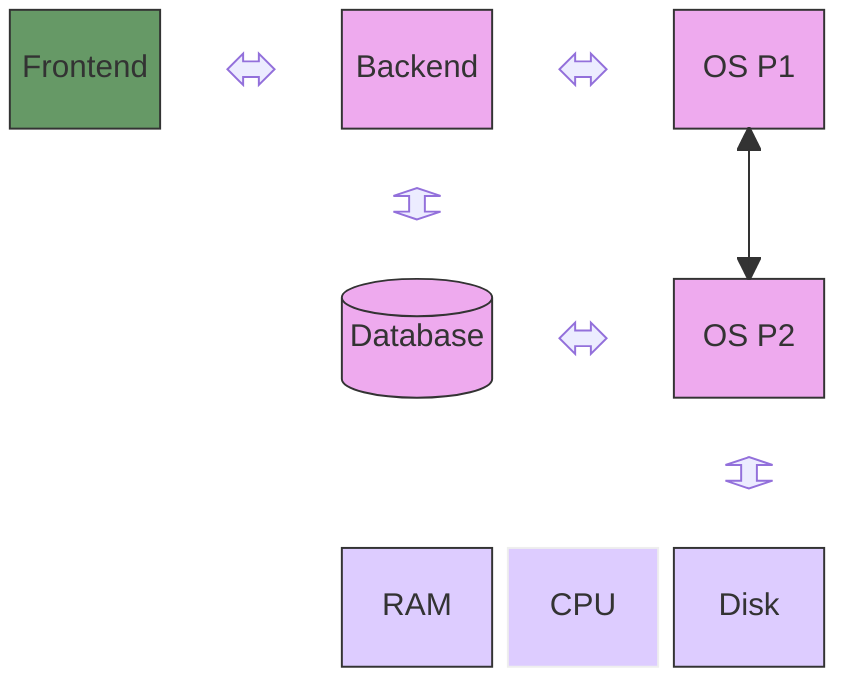

```mermaid
block
  columns 5
  Frontend blockArrowId1<[" "]>(right,left) Backend blockArrowId2<[" "]>(right,left) OSid1["OS P1"]
  space:2 blockArrowId3<[" "]>(down,up)
  space:4
  Database[("Database")] blockArrowId4<[" "]>(right,left) OSid2["OS P2"]
  space:4 blockArrowId5<[" "]>(down,up)
  space:2
  RAM CPU Disk
  
  classDef front fill:#696,stroke:#333;
  classDef back fill:#eae,stroke:#333;
  classDef hw fill:#dcf,stroke:#333;
  classDef cpu fill:#dcf,stroke:#eee;
  class Frontend front
  class Backend,Database,OSid1,OSid2 back
  class Disk,RAM hw
  class CPU cpu
  OSid1 --> OSid2
  OSid2 --> OSid1
```
