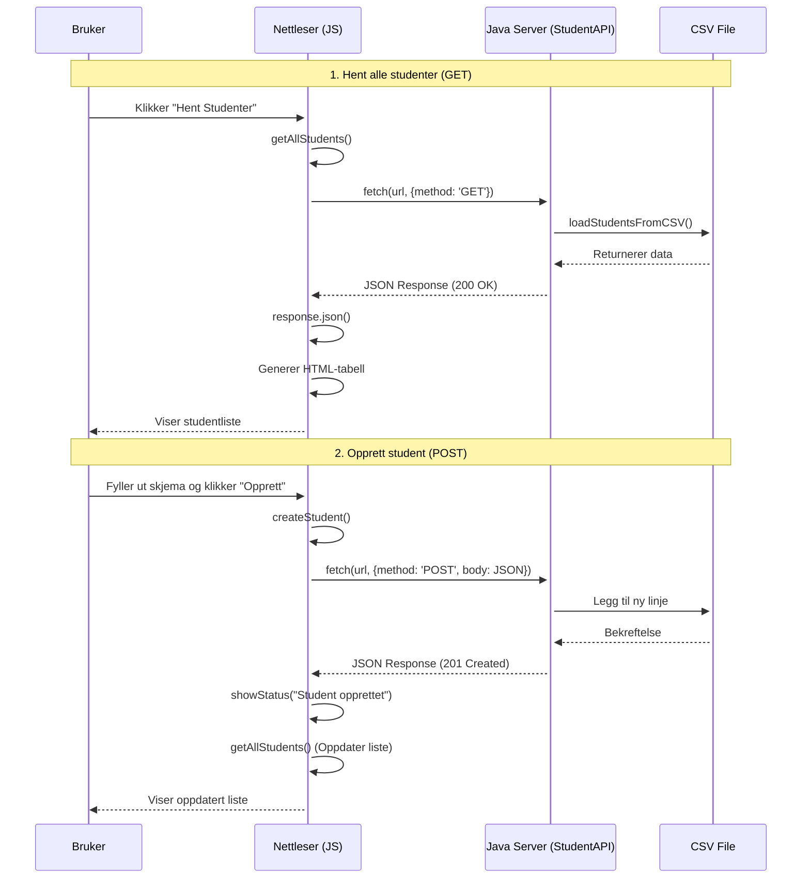

```mermaid
sequenceDiagram
    participant User as Bruker
    participant Browser as Nettleser (JS)
    participant Server as Java Server (StudentAPI)
    participant CSV as CSV File

    Note over User, CSV: 1. Hent alle studenter (GET)
    User->>+Browser: Klikker "Hent Studenter"
    Browser->>Browser: getAllStudents()
    Browser->>+Server: fetch(url, {method: 'GET'})
    Server->>+CSV: loadStudentsFromCSV()
    CSV-->>Server: Returnerer data
    Server-->>Browser: JSON Response (200 OK)
    Browser->>Browser: response.json()
    Browser->>Browser: Generer HTML-tabell
    Browser-->>User: Viser studentliste

    Note over User, CSV: 2. Opprett student (POST)
    User->>Browser: Fyller ut skjema og klikker "Opprett"
    Browser->>Browser: createStudent()
    Browser->>Server: fetch(url, {method: 'POST', body: JSON})
    Server->>CSV: Legg til ny linje
    CSV-->>Server: Bekreftelse
    Server-->>Browser: JSON Response (201 Created)
    Browser->>Browser: showStatus("Student opprettet")
    Browser->>Browser: getAllStudents() (Oppdater liste)
    Browser-->>User: Viser oppdatert liste
```