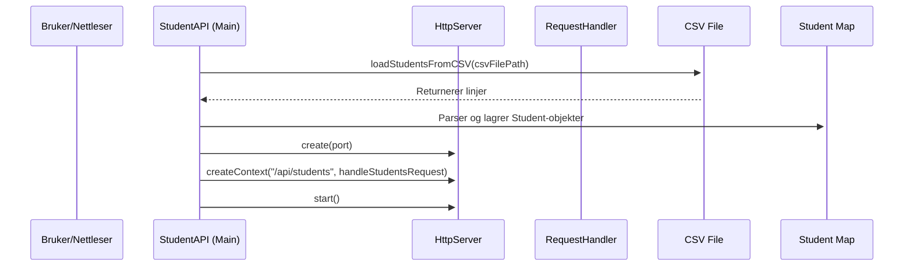

# Testing Mermaid

```mermaid
sequenceDiagram
    participant User as Bruker/Nettleser
    participant Main as StudentAPI (Main)
    participant Server as HttpServer
    participant Handler as RequestHandler
    participant CSV as CSV File
    participant Map as Student Map

    Main->>+CSV: loadStudentsFromCSV(csvFilePath)
    CSV-->>Main: Returnerer linjer
    Main->>+Map: Parser og lagrer Student-objekter
    Main->>+Server: create(port)
    Main->>Server: createContext("/api/students", handleStudentsRequest)
    Main->>Server: start()
```

