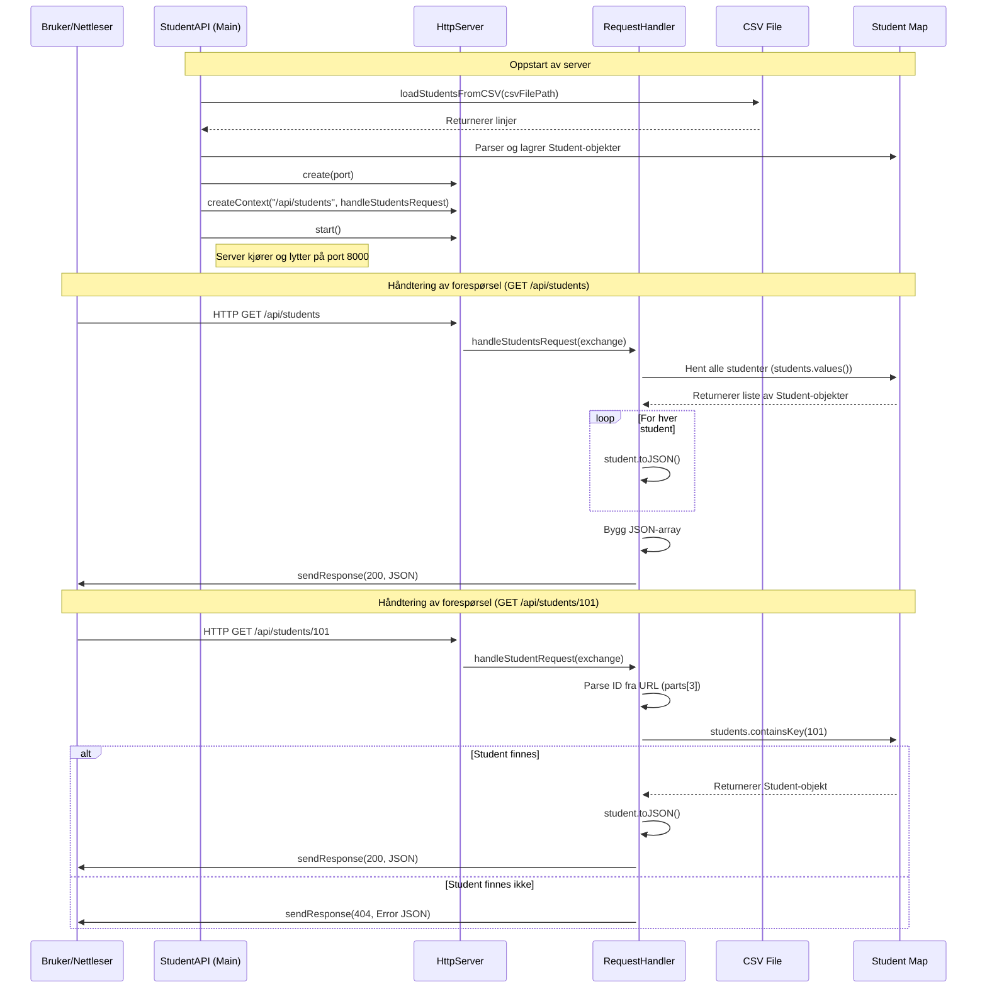

# Testing Mermaid

```mermaid
sequenceDiagram
    participant User as Bruker/Nettleser
    participant Main as StudentAPI (Main)
    participant Server as HttpServer
    participant Handler as RequestHandler
    participant CSV as CSV File
    participant Map as Student Map

    Note over Main, Map: Oppstart av server
    Main->>+CSV: loadStudentsFromCSV(csvFilePath)
    CSV-->>Main: Returnerer linjer
    Main->>+Map: Parser og lagrer Student-objekter
    Main->>+Server: create(port)
    Main->>Server: createContext("/api/students", handleStudentsRequest)
    Main->>Server: start()
    Note right of Main: Server kjører og lytter på port 8000

    Note over User, Map: Håndtering av forespørsel (GET /api/students)
    User->>Server: HTTP GET /api/students
    Server->>+Handler: handleStudentsRequest(exchange)
    Handler->>Map: Hent alle studenter (students.values())
    Map-->>Handler: Returnerer liste av Student-objekter
    loop For hver student
        Handler->>Handler: student.toJSON()
    end
    Handler->>Handler: Bygg JSON-array
    Handler->>User: sendResponse(200, JSON)

    Note over User, Map: Håndtering av forespørsel (GET /api/students/101)
    User->>Server: HTTP GET /api/students/101
    Server->>Handler: handleStudentRequest(exchange)
    Handler->>Handler: Parse ID fra URL (parts[3])
    Handler->>Map: students.containsKey(101)
    alt Student finnes
        Map-->>Handler: Returnerer Student-objekt
        Handler->>Handler: student.toJSON()
        Handler->>User: sendResponse(200, JSON)
    else Student finnes ikke
        Handler->>User: sendResponse(404, Error JSON)
    end
```

