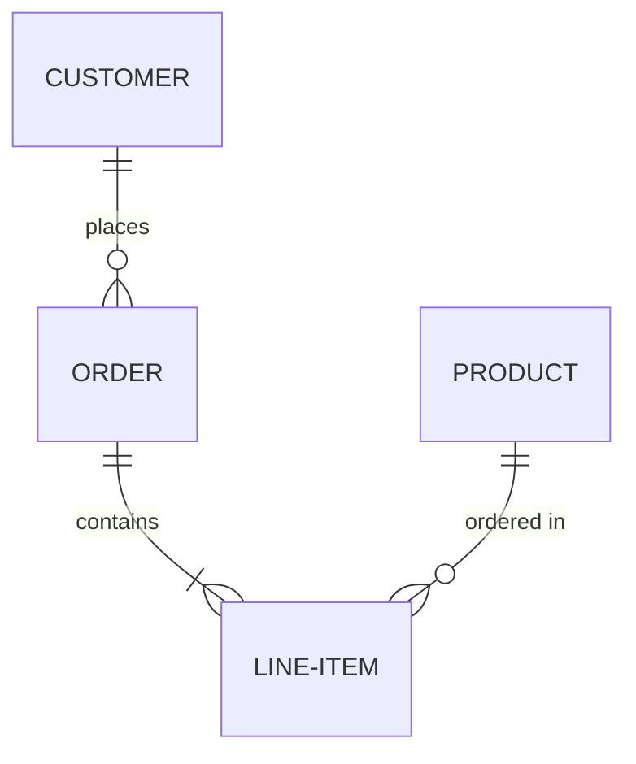
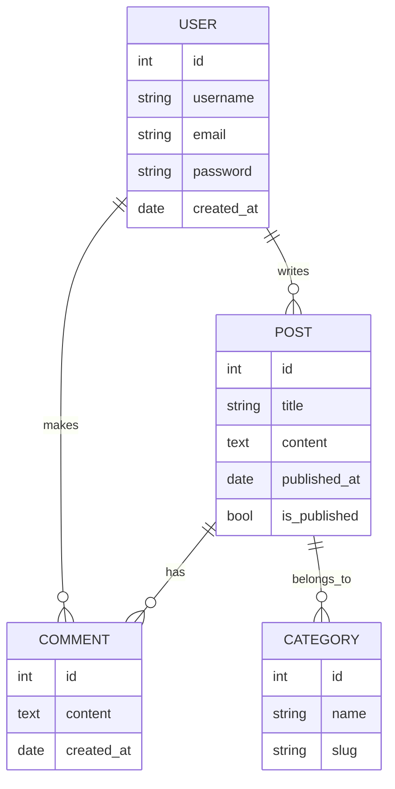

```mermaid
erDiagram
    CUSTOMER ||--o{ ORDER : places
    ORDER ||--|{ LINE-ITEM : contains
    PRODUCT ||--o{ LINE-ITEM : "ordered in"
```

```mermaid
erDiagram
    USER ||--o{ POST : writes
    USER ||--o{ COMMENT : makes
    USER {
        int id
        string username
        string email
        string password
        date created_at
    }
    POST ||--o{ COMMENT : has
    POST ||--o{ CATEGORY : belongs_to
    POST {
        int id
        string title
        text content
        date published_at
        bool is_published
    }
    COMMENT {
        int id
        text content
        date created_at
    }
    CATEGORY {
        int id
        string name
        string slug
    }
```