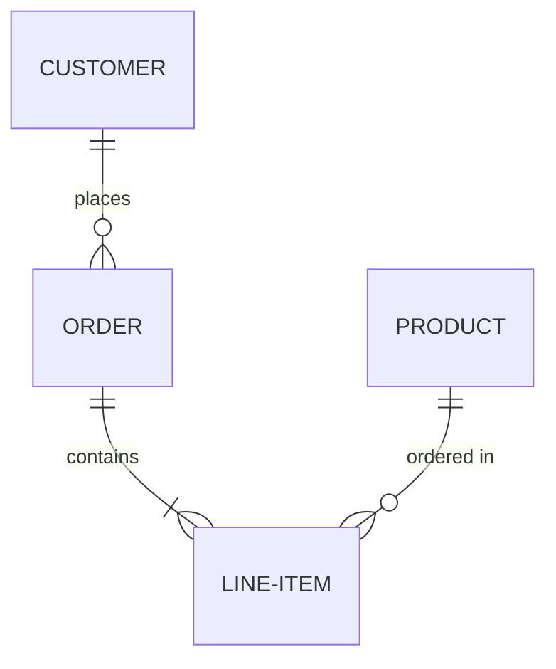
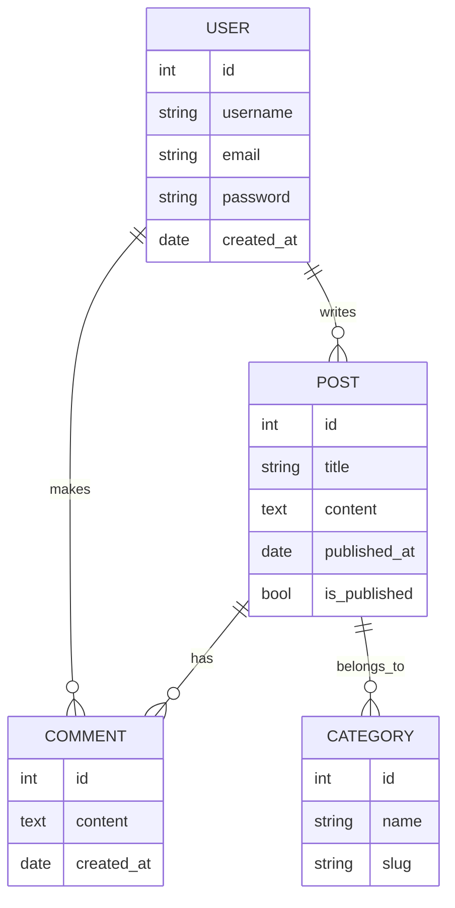
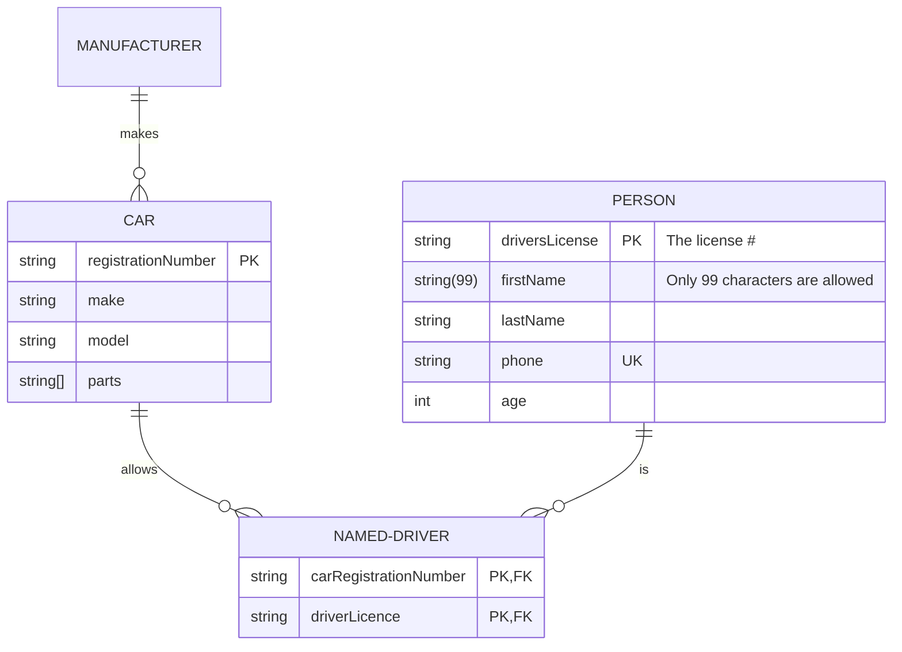
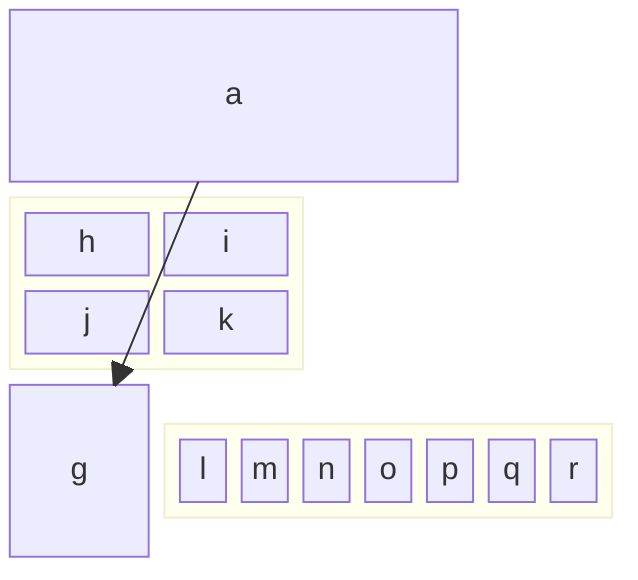

```mermaid
erDiagram
    CUSTOMER ||--o{ ORDER : places
    ORDER ||--|{ LINE-ITEM : contains
    PRODUCT ||--o{ LINE-ITEM : "ordered in"
```

```mermaid
erDiagram
    USER ||--o{ POST : writes
    USER ||--o{ COMMENT : makes
    USER {
        int id
        string username
        string email
        string password
        date created_at
    }
    POST ||--o{ COMMENT : has
    POST ||--o{ CATEGORY : belongs_to
    POST {
        int id
        string title
        text content
        date published_at
        bool is_published
    }
    COMMENT {
        int id
        text content
        date created_at
    }
    CATEGORY {
        int id
        string name
        string slug
    }
```

```mermaid
erDiagram
    CAR ||--o{ NAMED-DRIVER : allows
    CAR {
        string registrationNumber PK
        string make
        string model
        string[] parts
    }
    PERSON ||--o{ NAMED-DRIVER : is
    PERSON {
        string driversLicense PK "The license #"
        string(99) firstName "Only 99 characters are allowed"
        string lastName
        string phone UK
        int age
    }
    NAMED-DRIVER {
        string carRegistrationNumber PK, FK
        string driverLicence PK, FK
    }
    MANUFACTURER only one to zero or more CAR : makes
```

```mermaid
block
  columns 3
  a:3
  block:group1:2
    columns 2
    h i j k
  end
  space
  g
  block:group2:3
    %% columns auto (default)
    l m n o p q r
  end
  a --> g
```
